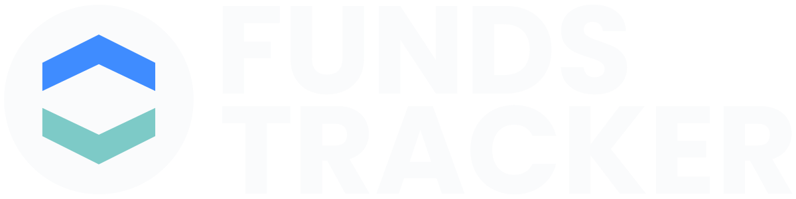

<div align='center'>
    

  <h3>
    Manage all your investments in one place
  </h3>

  <h4>
    <a href="https://funds-tracker.com">View App</a>
  <span> · </span>
    <a href="https://github.com/bartlomiej-kochanowicz/funds-tracker">Documentation</a>
  <span> · </span>
    <a href="https://github.com/bartlomiej-kochanowicz/funds-tracker/issues">Report Bug</a>
  <span> · </span>
    <a href="https://github.com/bartlomiej-kochanowicz/funds-tracker/issues">Request Feature</a>
  </h4>
</div>

<br />

# :notebook_with_decorative_cover: Table of Contents

- [💸 About the Project](#-about-the-project)
  - [📄 Project board](#-project-board)
  - [🧨 Tech Stack](#-tech-stack)
  - [🪨 Milestones](#-milestones)
- [🛠 Getting Started](#-getting-started)
  - [🧰 Prerequisites](#-prerequisites)
  - [⚙ Installation](#%EF%B8%8F-installation)
  - [🧷 Environment Variables](#-environment-variables)
  - [🏃 Run Locally](#-run-locally)
  - [💥 Deployment](#-deployment)

## 💸 About the Project

<p>In the application you can create your custom investment model portfolio, add your financial instruments like: <strong>stocks, bonds, crypto, deposits and saving acconuts</strong>, select the interval you want to update instruments worth and provide a new values. The algorithm calculates
deviation from the model you provide before, tells you how to rebalance the instruments of the portfolio and shows summary. <strong>You can admire how your savings grow 📈</strong></p>

### [📄 Project board](https://github.com/users/bartlomiej-kochanowicz/projects/3)

### 🧨 Tech Stack

<details>
  <summary>Client</summary>
  <ul>
    <li><a href="https://www.typescriptlang.org/">Typescript</a></li>
    <li><a href="https://vitejs.dev/">Vitejs</a></li>
    <li><a href="https://reactjs.org/">React.js</a></li>
    <li><a href="https://tailwindcss.com/">Tailwind</a></li>
    <li><a href="https://www.i18next.com/">i18next</a></li>
    <li><a href="https://reactrouter.com/">React Router</a></li>
    <li><a href="https://www.react-laag.com/">React Laag</a></li>
  </ul>
</details>

<details>
  <summary>Server</summary>
  <ul>
    <li><a href="https://www.typescriptlang.org/">Typescript</a></li>
    <li><a href="https://nestjs.com/">Nest.js</a></li>
    <li><a href="https://www.apollographql.com/">Apollo</a></li>
    <li><a href="https://jwt.io/introduction">JWT</a></li>
    <li><a href="https://sendgrid.com/">Sendgrid</a></li>
    <li><a href="https://graphql.org/">GraphQL</a></li>
  </ul>
</details>

<details>
<summary>Database</summary>
  <ul>
    <li><a href="https://www.postgresql.org/">PostgreSQL</a></li>
    <li><a href="https://www.prisma.io/">Prisma</a></li>
    <li><a href="https://redis.io/">Redis</a></li>
  </ul>
</details>

<details>
<summary>DevOps</summary>
  <ul>
    <li><a href="https://www.docker.com/">Docker</a></li>
    <li><a href="https://www.ovhcloud.com/">OVH Cloud</a></li>
    <li><a href="https://vercel.com/">Vercel</a></li>
    <li><a href="https://turbo.build/repo">Turborepo</a></li>
    <li><a href="https://github.com/features/actions">Github Actions</a></li>
  </ul>
</details>

### 🪨 Milestones

- [x] Setup app/deployment
- [x] Signin, Signup, Authentication
- [x] Cash accounts page
- [x] Mobile hub
- [ ] Portfolio page
- [ ] History page
- [ ] Dashboard page
- [ ] Transactions page
- [ ] My profile/Settings page

## 🛠 Getting Started

### 🧰 Prerequisites

This project uses [pnpm](https://pnpm.io/installation) as package manager and docker to run the application locally.

### ⚙️ Installation

Install funds-tracker with pnpm

```bash
  $ pnpm install
  $ pnpm comose
```

### 🧷 Environment Variables

Duplicate .env.example file for each <strong>root, webapp and webserver</strong> catalog and fill keys with given values

### 🏃 Run Locally

Start dev server

```bash
  $ pnpm dev
```

Start webapp

```bash
  $ pnpm dev:webapp
```

Start api

```bash
  $ pnpm dev:api
```

### 💥 Deployment

To deploy this project just push the changes to your remote branch, create Pull Request, wait for CI/CD to be done and merge to main.
