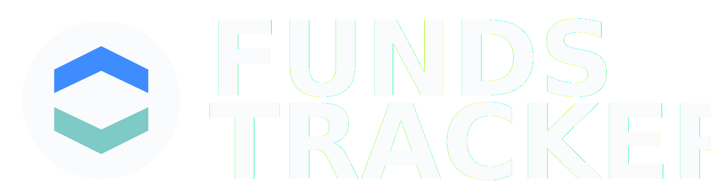

<div align='center'>
    

  <h1>
    Funds Tracker
  </h1>

  <h3>
    Manage all your investments in one place as simple as possible
  </h3>

  <h4>
    <a href="https://funds-tracker.com">View App</a>
  <span> · </span>
    <a href="https://github.com/bartlomiej-kochanowicz/funds-tracker">Documentation</a>
  <span> · </span>
    <a href="https://github.com/bartlomiej-kochanowicz/funds-tracker/issues">Report Bug</a>
  <span> · </span>
    <a href="https://github.com/bartlomiej-kochanowicz/funds-tracker/issues">Request Feature</a>
  </h4>
</div>

<br />

# :notebook_with_decorative_cover: Table of Contents

- [About the Project](#💸-About-the-Project)
  - [Tech Stack](#🧨-Tech-Stack)
  - [Milestones](#🪨-Milestones)
- [Getting Started](#🛠-Getting-Started)
  - [Prerequisites](#🧰-Prerequisites)
  - [Installation](#⚙️-Installation)
  - [Running Tests](#test_tube-running-tests)
  - [Run Locally](#running-run-locally)
  - [Deployment](#triangular_flag_on_post-deployment)

## 💸 About the Project

<p>In the application you can create your custom investment model portfolio, add your financial instruments like: <strong>stocks, bonds, crypto, deposits and saving acconuts</strong>, select the interval you want to update instruments worth and provide a new values. The algorithm calculates
deviation from the model you provide before, tells you how to rebalance the instruments of the portfolio and shows summary. <strong>You can admire how your savings grow 📈</strong></p>

### 🧨 Tech Stack

<details>
  <summary>Client</summary>
  <ul>
    <li><a href="https://www.typescriptlang.org/">Typescript</a></li>
    <li><a href="https://vitejs.dev/">Vitejs</a></li>
    <li><a href="https://reactjs.org/">React.js</a></li>
    <li><a href="https://styled-components.com/">Styled Components</a></li>
    <li><a href="https://www.i18next.com/">i18next</a></li>
    <li><a href="https://reactrouter.com/">React Router</a></li>
    <li><a href="https://www.react-laag.com/">React Laag</a></li>
    <li><a href="https://github.com/llorentegerman/simple-flexbox">Simple Flexbox</a></li>
  </ul>
</details>

<details>
  <summary>Server</summary>
  <ul>
    <li><a href="https://www.typescriptlang.org/">Typescript</a></li>
    <li><a href="https://nestjs.com/">Nest.js</a></li>
  </ul>
</details>

<details>
<summary>Database</summary>
  <ul>
    <li><a href="https://www.postgresql.org/">PostgreSQL</a></li>
    <li><a href="https://www.prisma.io/">Prisma</a></li>
  </ul>
</details>

<details>
<summary>DevOps</summary>
  <ul>
    <li><a href="https://www.docker.com/">Docker</a></li>
    <li><a href="https://aws.amazon.com/">AWS</a></li>
    <li><a href="https://github.com/features/actions">Github Actions</a></li>
  </ul>
</details>

### 🫡 To do

- [x] introduction client (add money account and first instrument)
- [ ] introduction api (add money account and first instrument)
- [ ] summary page
- [x] add redux
- [x] add toasts

### 🪨 Milestones

- [x] Create monorepo
- [x] CI for webapp
- [ ] Setup production deploy
- [x] Dashboard

## 🛠 Getting Started

### 🧰 Prerequisites

This project uses [pnpm](https://pnpm.io/installation) as package manager and docker to run the application locally.

### ⚙️ Installation

Install funds-tracker with pnpm

```bash
  $ pnpm install:all
  $ make build
```

### :running: Run Locally

Start monorepo

```bash
  $ make up
```

Start webapp only (bypass docker)

```bash
  $ pnpm start:webapp
```

Start webserver only (bypass docker)

```bash
  $ pnpm start:webserver
```

### :triangular_flag_on_post: Deployment

To deploy this project just push the changes to your remote branch, create Pull Request, wait for CI/CD to be done and merge to master.
